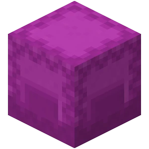

# Shulker Dupe Rewritten

    
     
    
    
    

A more libre implementation of the original [shulker dupe mod](https://github.com/gingerchicken/shulker-dupe) built so that people can use it in whatever projects they like.
